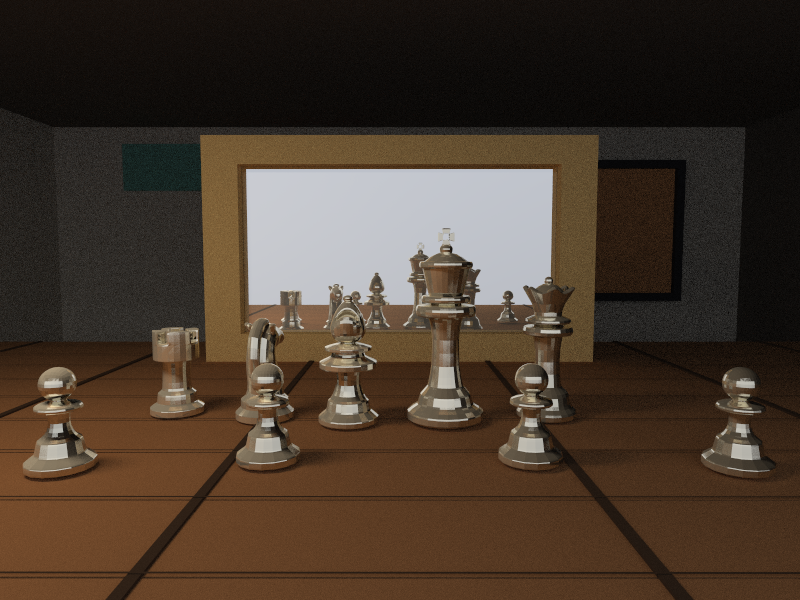
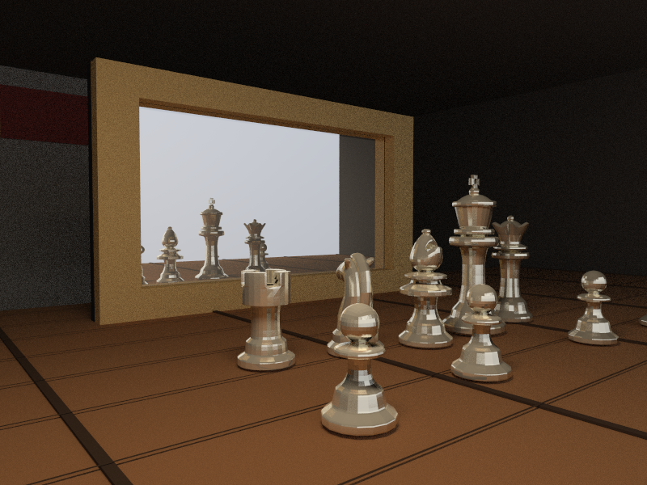

# Originality Declaration

We declare that this submission is our own work except where external sources
are explicitly cited. AI tools were used for brainstorming, debugging support,
and language polishing. The renderer implementation, scene geometry, parameter
choices, and final generated images should be reviewed and completed by the team
before submission.

# Outer Limits Observation Deck: A Self-Contained Monte Carlo Renderer

**Authors:** [Team Member 1]*, [Team Member 2], [Team Member 3]

## Abstract

This project implements a compact C++ Monte Carlo path tracer and uses it to
render a science-fiction observation deck looking toward a black hole. The scene
is inspired by Dario Seyb's black-hole bridge submission for Dartmouth College's
2019 Rendering Competition, which was part of the "The Outer Limits" theme. Our
pipeline creates the scene geometry as OBJ/MTL files, reloads the mesh data, and
renders the final images with soft shadows, glass, metal, emissive surfaces, and
procedural space environments.

## 1. Project Goal and Scope

The goal is to build a valid Research Project 2 rendering submission with an
original 3D scene, a custom renderer, user-controlled parameters, and at least
two viewpoints of the same scene. The chosen visual target is a bridge-like
interior framing an extreme outer-space phenomenon. We simplified the reference
into a small observation deck, a large window, an accretion disk, and reflective
props so that the final result is achievable with a self-contained renderer.

## 2. Accomplishments

The completed codebase provides a C++17 executable that generates an OBJ scene,
loads the generated mesh, and renders it using path tracing. The scene includes
walls, ceiling, floor, window frame, glass, a control console, chairs, a probe
sphere, area lights, and an emissive accretion disk. Command-line controls allow
the evaluator to adjust camera parameters, object pose, material values, shadow
visibility, light configuration, and environment style.

## 3. Scene Construction

The scene is procedurally modeled by code rather than downloaded as a flat
image. Boxes are represented as triangle meshes, the probe is a tessellated
sphere, and the accretion disk is a ring mesh with emissive material. Each run
writes `scenes/generated_scene.obj` and `scenes/generated_scene.mtl`, then reloads
the OBJ for rendering. This satisfies the mesh-based scene requirement while
keeping the asset pipeline reproducible.

## 4. Rendering Method

The renderer estimates the rendering equation with Monte Carlo path tracing.
Rays are generated from a pinhole camera with jittered pixel samples. The
triangle scene is accelerated using a bounding volume hierarchy. At each surface
hit, emitted radiance is accumulated, sampled area-light contribution is added,
and a new path direction is sampled according to the material.

The target integral is the outgoing radiance

```text
L_o(x, w_o) = L_e(x, w_o) + integral_H f_r(x, w_i, w_o) L_i(x, w_i) cos(theta_i) dw_i.
```

Our implementation estimates this integral by tracing randomly sampled light
paths. For each camera ray, the estimator accumulates emitted radiance, one
sampled direct-light term from each finite light panel, and then recursively
continues the path according to the surface material. Russian roulette is used
after several bounces to avoid wasting samples on paths whose throughput has
become very small.

Diffuse materials use cosine-weighted hemisphere sampling. Metal surfaces reflect
the incoming direction with a user-controlled roughness value. Glass uses
reflection/refraction with Schlick Fresnel weighting and a fixed index of
refraction. Emissive triangles are sampled as finite area lights, producing soft
shadows when shadow rays are enabled.

The BVH is built over triangle bounding boxes. Each internal node splits the
primitive set along the largest centroid axis, while leaves store a small number
of triangles. This keeps the renderer responsive enough for repeated
experimentation at 800 by 600 pixels.

## 5. User Controls

The executable exposes the required parameterized input:

- Camera position and orientation: `--camera` and `--look-at`.
- Object position and pose: `--object-offset` and `--object-rotate-y`.
- Surface materials: `--floor-color` and `--metal-roughness`.
- Shadow toggle: `--shadows 0` or `--shadows 1`.
- Light source position, size, and count: `--light-pos`, `--light-size`, and `--extra-light`.
- Environment selection: `--environment space`, `studio`, or `sunset`.

## 6. Rendering Results and Experiments

The required renderings should be generated with:

```bash
./build/OuterLimitsRenderer --preset main --width 800 --height 600 --spp 32 --output renders/view_main.ppm
./build/OuterLimitsRenderer --preset side --width 800 --height 600 --spp 32 --output renders/view_side.ppm
```

The following two images show the same scene from different camera viewpoints,
demonstrating that the output comes from a 3D scene rather than from a flat
source image.

| Main viewpoint | Side viewpoint |
| --- | --- |
|  |  |

The main viewpoint faces the window directly and emphasizes the black-hole
silhouette, the accretion-disk glow, and the refractive probe. The side viewpoint
reveals parallax in the window frame, console, probe, and room geometry.

| Experiment | Command-line change | Expected visual effect |
| --- | --- | --- |
| Shadow ablation | `--shadows 0` | Removes occlusion from the light panels, making the room flatter. |
| Rough metal | `--metal-roughness 0.45` | Blurs reflections on the window frame and console trim. |
| Extra area light | `--extra-light 1` | Adds side highlights and reduces dark wall noise. |
| Alternative environment | `--environment sunset` | Replaces the space background with warmer sky lighting. |

Recommended additional comparisons:

- shadows on versus shadows off;
- rough metal versus polished metal;
- `space` versus `sunset` environment;
- main light only versus two area lights.

## 7. Discussion

The strongest part of the project is the complete mesh-to-render pipeline. The
renderer is small enough to explain in a seminar but includes the important
features expected in a realistic rendering project: global illumination, soft
shadows, reflection, refraction, emissive surfaces, and acceleration structures.

The main limitation is that the black hole is artistically approximated rather
than simulated with general-relativistic ray bending. A future version could add
spectral rendering, measured HDR environment maps, denoising, depth of field,
and a physically based accretion-disk model.

Another limitation is sampling noise. The generated 32 samples-per-pixel images
are fast to reproduce, but a final competition-quality figure should be rendered
with 64 or 128 samples per pixel if time permits. The code is deterministic for
a fixed command and supports multi-threading, so this is a quality/time tradeoff
rather than a change to the algorithm.

## 8. Conclusion

This project delivers an original 3D scene and a custom renderer suitable for a
short conference-style report and a four-minute presentation. It demonstrates
scene generation, OBJ loading, Monte Carlo light transport, material variation,
soft shadows, and multi-view rendering results.

## References

1. Dartmouth College Rendering Competition 2019, "The Outer Limits":
   https://www.cs.dartmouth.edu/~rendering-competition/fa2019/
2. Dario Seyb, Dartmouth Rendering Algorithms FA19 final project:
   https://www.cs.dartmouth.edu/~rendering-competition/fa2019/submissions/seybdario/
3. Peter Shirley, *Ray Tracing in One Weekend* series:
   https://raytracing.github.io/
4. Pharr, Jakob, and Humphreys, *Physically Based Rendering: From Theory to
   Implementation*: https://www.pbr-book.org/
